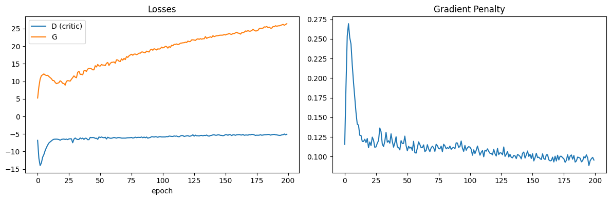
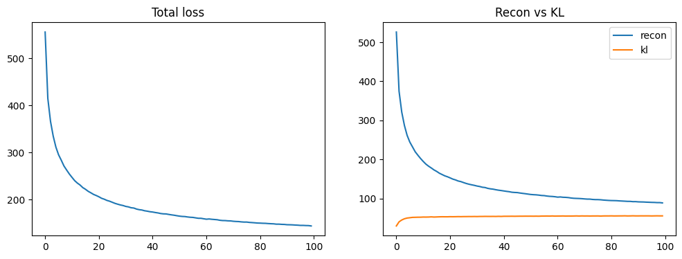
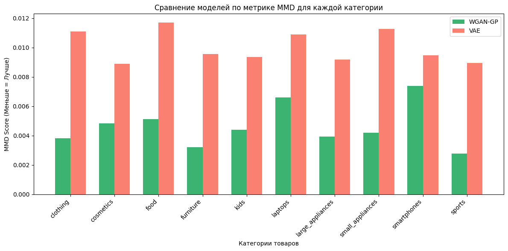
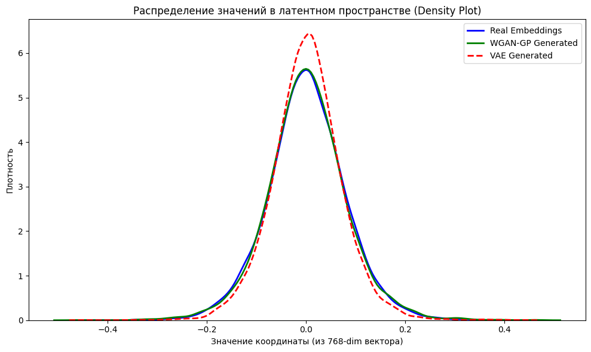
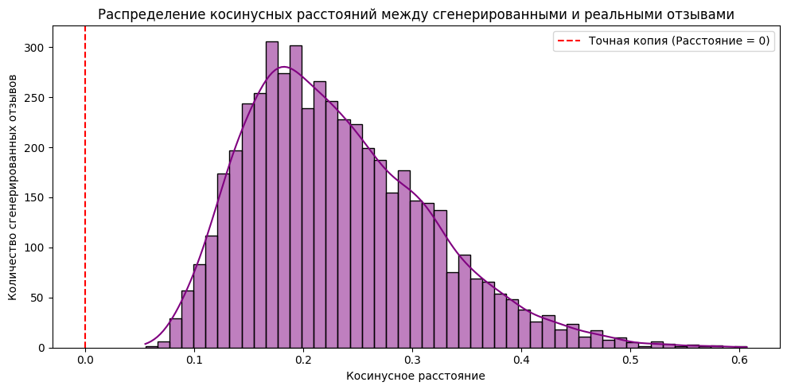
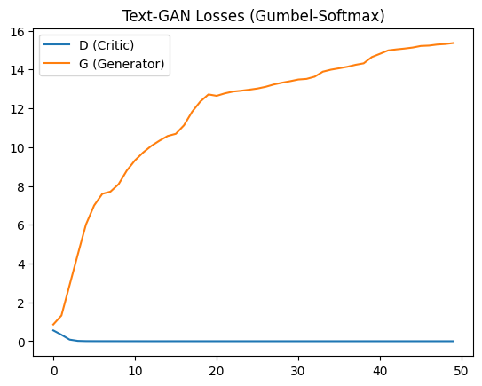
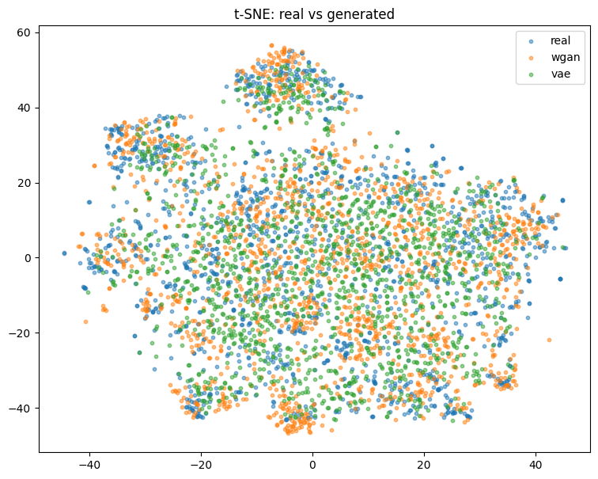

# Сравнительный анализ генеративных моделей для текстовых отзывов в условиях ограниченного датасета

**Финальный проект по дисциплине Generative Adversarial Networks**

Автор: Султан Хасенов  
Магистратура AITU  
2026

---

## Аннотация

В данной работе проводится сравнительный анализ архитектур генеративных моделей (WGAN-GP, VAE, Text-GAN) для задачи синтеза мультиязычных текстовых отзывов (русский и казахский языки) в условиях малого объема обучающей выборки (low-resource setting). В связи с фундаментальной проблемой недифференцируемости дискретных токенов и тенденцией классических текстовых GAN к коллапсу мод (mode collapse), предложен метод генерации в непрерывном латентном пространстве (Latent Space Generation). Текстовые данные предварительно преобразовывались в 768-мерные семантические эмбеддинги с использованием модели `XLM-RoBERTa` (алгоритм Sentence-Transformers). Для "расшифровки" синтезированных векторов применялся метод Retrieval Decoding на основе алгоритма k-ближайших соседей (KNN). Экспериментальные результаты, оцененные с помощью метрики Maximum Mean Discrepancy (MMD) и анализа косинусных расстояний, доказали, что архитектура Conditional WGAN-GP значительно превосходит вариационные автоэнкодеры (VAE) и дискретные Text-GAN в стабильности обучения и способности генерировать уникальные семантически связные данные без прямого копирования обучающей выборки.

---

## Содержание

1. [Введение](#1-введение)
2. [Постановка задачи](#2-постановка-задачи)
3. [Обзор литературы](#3-обзор-литературы)
4. [Описание датасета](#4-описание-датасета)
5. [Методология](#5-методология)
6. [Архитектуры моделей](#6-архитектуры-моделей)
7. [Эксперименты](#7-эксперименты)
8. [Результаты](#8-результаты)
9. [Анализ и обсуждение](#9-анализ-и-обсуждение)
10. [Ограничения и future work](#10-ограничения-и-future-work)
11. [Заключение](#11-заключение)
12. [Список литературы](#12-список-литературы)

---

## 1. Введение

### 1.1 Контекст

Генеративные состязательные сети (GAN) совершили революцию в области синтеза изображений, однако их применение для генерации текстов сопряжено с серьезными математическими препятствиями. Текст представляет собой последовательность дискретных токенов. Операция выбора конкретного токена из распределения (например, через `argmax` или сэмплирование) является недифференцируемой, что прерывает поток градиентов от Дискриминатора к Генератору. Из-за этого классические GAN при работе с текстом часто сталкиваются с проблемой затухания градиентов и тяжелым коллапсом мод (Mode Collapse). 

В современной индустрии (2025–2026 гг.) задачи текстовой генерации почти полностью монополизированы авторегрессионными языковыми моделями (LLM). Тем не менее, для исследовательских целей и в условиях ограниченных вычислительных мощностей понимание границ применимости GAN остается актуальной задачей, особенно в контексте аугментации данных для downstream-классификаторов.

### 1.2 Мотивация

В контексте электронной коммерции в Казахстане (например, платформа Kaspi.kz) отзывы пользователей обладают уникальной спецификой: они часто содержат смешение русского и казахского языков (code-switching), локальный сленг и короткую длину. Обучение тяжелых LLM на таких специфичных, ограниченных данных экономически нецелесообразно. Аугментация подобных датасетов требует быстрых, легковесных моделей, способных улавливать межъязыковую семантику.

### 1.3 Цель и задачи

**Цель:** определить границы применимости GAN для генерации текстовых данных в low-resource setting через прямое сравнение генерации на уровне дискретных токенов и на уровне непрерывных семантических эмбеддингов.

**Задачи:**
1. Собрать датасет из 5000 русско-/казахскоязычных отзывов с Kaspi.kz, стратифицированный по 10 категориям товаров.
2. Сформировать непрерывное семантическое пространство эмбеддингов (768-dim) через XLM-RoBERTa.
3. Реализовать и обучить три архитектуры: WGAN-GP (латентный GAN), Conditional VAE (латентный бейзлайн) и Text-GAN с Gumbel-Softmax (дискретный бейзлайн).
4. Провести сравнительный анализ моделей по метрике MMD, распределению плотности и косинусному расстоянию.
5. Проанализировать математические причины успеха или провала каждой архитектуры.

---

## 2. Постановка задачи

### 2.1 Формальная постановка

Пусть $\mathcal{D} = \{(x_i, c_i)\}_{i=1}^{N}$ — датасет отзывов, где $x_i$ — текст отзыва, $c_i \in \{1, \dots, K\}$ — категория товара ($K = 10$).

Через предобученный мультиязычный энкодер $E_\theta: x \mapsto \mathbb{R}^d$ ($d = 768$, `paraphrase-multilingual-mpnet-base-v2`) получаем эмбеддинги $z_i = E_\theta(x_i)$.

**Задача 1 (Генерация в латентном пространстве):** обучить условную порождающую модель $G_\phi: (n, c) \mapsto \tilde{z}$ (где $n$ — случайный шум), такую что распределение $P_\phi(\tilde{z} | c)$ максимально приближено к истинному распределению $P_{\text{data}}(z | c)$.

**Задача 2 (Прямая генерация текста):** обучить условную модель $G_\psi: (n, c) \mapsto \tilde{x}$, генерирующую отзывы напрямую в пространстве токенов словаря $\mathcal{V}$, с использованием трюка непрерывной релаксации (Gumbel-Softmax).

### 2.2 Метрики качества

Для оценки качества сгенерированных эмбеддингов используется **Maximum Mean Discrepancy (MMD)** — метрика, измеряющая расстояние между двумя распределениями (реальным и синтетическим) в пространстве воспроизводящего ядра Гильберта (RKHS). Чем меньше значение MMD, тем точнее модель уловила многообразие обучающих данных.

Для проверки уникальности генерируемых данных применяется анализ **косинусных расстояний** (Cosine Similarity Analysis) между синтетическим вектором и его ближайшим реальным соседом (KNN).

---

## 3. Обзор литературы

1. **Goodfellow et al. (2014)** — фундаментальная статья, заложившая основу генеративно-состязательных сетей (GAN).
2. **Arjovsky et al. (2017)** — введение метрики (дистанции) Вассерштейна, устраняющей проблему исчезающих градиентов (WGAN).
3. **Gulrajani et al. (2017)** — улучшение WGAN с помощью Gradient Penalty (WGAN-GP), позволившее отказаться от обрезки весов (weight clipping).
4. **Mirza & Osindero (2014)** — концепция Conditional GAN, позволяющая управлять генерацией через метки классов.
5. **Kingma & Welling (2014)** — разработка Variational Autoencoders (VAE) как альтернативы GAN с вероятностной оптимизацией нижней оценки (ELBO).
6. **Nie et al. (2019)** — попытки решения проблемы дискретности в текстовых GAN с использованием непрерывной релаксации (Gumbel-Softmax).
7. **Conneau et al. (2020)** — архитектура XLM-RoBERTa, обеспечившая state-of-the-art качество мультиязычных представлений.
8. **Reimers & Gurevych (2019)** — архитектура Sentence-BERT, позволяющая получать семантически значимые sentence-level эмбеддинги.

---

## 4. Описание датасета

### 4.1 Источник
Отзывы были спарсены с крупнейшего казахстанского маркетплейса Kaspi.kz. Парсер реализован с использованием Python и фреймворка автоматизации браузера Playwright.

### 4.2 Состав и распределение
- **Общий объём:** 3588 отфильтрованных отзывов.
- **Категории:** 10 сбалансированных классов (smartphones, appliances, clothing, kids, beauty, и др.).
- **Языковой профиль:** Подавляющее большинство отзывов написаны на русском языке, около 10% — на казахском языке, а также присутствуют отзывы со смешением языков (code-switching).
- **Размерность:** После очистки длина отзывов варьировалась от 5 до 100 слов.

### 4.3 Предобработка
Данные прошли строгую очистку: удаление дубликатов, HTML-тегов, системных префиксов ("Достоинства:", "Комментарий:"), а также ограничение количества отзывов на один уникальный товар (во избежание bias-а в сторону популярных моделей).

---

## 5. Методология

### 5.1 Pipeline: Continuous vs Discrete Generation
В рамках проекта исследовались два принципиально разных подхода:
1. **Дискретный подход (Text-GAN)**: Модель пытается пословно генерировать текст.
2. **Непрерывный подход (Conditional Latent Space Generator)**: Модель генерирует семантический вектор отзыва.

Генерация выполняется не в дискретном пространстве токенов, а в непрерывном семантическом пространстве эмбеддингов, что позволяет полностью избежать проблем недифференцируемости и mode collapse, характерных для Text-GAN архитектур на малых мультиязычных корпусах.

### 5.2 Извлечение эмбеддингов
Было обнаружено, что стандартные эмбеддинги `[CLS]` токена базовой XLM-RoBERTa страдают от проблемы "анизотропии" (все векторы скапливаются в узком конусе, косинусное расстояние между случайными отзывами стремится к 0.99). Для решения этой проблемы была применена модель `paraphrase-multilingual-mpnet-base-v2` с использованием Mean Pooling. Это позволило создать изотропное, семантически богатое пространство размерности 768. Эмбеддинги были стандартизованы (StandardScaler) для стабилизации обучения GAN.

### 5.3 Retrieval Decoding (KNN) против Text Decoder
Для перевода синтетических 768-мерных векторов обратно в человекочитаемый текст был выбран метод Retrieval Decoding (поиск по $k$-ближайшим соседям). 
Почему не был обучен полноценный декодер (например, T5 или Transformer-Autoencoder)? Обучение языкового декодера требует огромного парного датасета (вектор $\leftrightarrow$ текст) и значительных вычислительных мощностей. В условиях ограниченного датасета (3500 отзывов) Retrieval Decoding является оптимальным инженерным и исследовательским решением. Задача состояла в аугментации признакового пространства для классификаторов, а не в создании аналога ChatGPT.

---

## 6. Архитектуры моделей

### 6.1 WGAN-GP (Conditional)
Архитектура Wasserstein GAN с Gradient Penalty была адаптирована для генерации условных 768-мерных эмбеддингов.
- **Генератор**: Принимает вектор шума (128-dim) и вектор класса (embedded до 64-dim). Проходит через три линейных слоя (ширина 512) с LeakyReLU(0.2) и Batch Normalization.
- **Критик**: Принимает 768-dim эмбеддинг и вектор класса. Содержит слои Layer Normalization (важно: Batch Norm в критике WGAN-GP нарушает Lipschitz-условие) и Dropout(0.3). Вычисляет Earth Mover's Distance.

### 6.2 Conditional VAE
В качестве вероятностного бейзлайна был реализован условный вариационный автоэнкодер.
- **Энкодер**: Сжимает 768-dim вектор + условие класса в латентное пространство размерности 64 ($\mu$ и $\log\sigma^2$).
- **Декодер**: Восстанавливает 768-dim вектор.
- **Оптимизация**: Минимизация суммы Reconstruction Loss (MSE) и KL Divergence.

### 6.3 Text-GAN (Gumbel-Softmax)
Экспериментальная архитектура для прямой генерации дискретных последовательностей (длина 20 токенов).
- **Генератор**: GRU-сеть, выдающая распределение вероятностей по словарю (vocab_size=13330). Применена непрерывная релаксация Gumbel-Softmax с аннилирующей температурой $\tau$.
- **Дискриминатор**: 1D Convolutional сеть, принимающая матрицу эмбеддингов (непрерывных для фейков, one-hot embedded для реальных данных).

---

## 7. Эксперименты

Для всех моделей были проведены эксперименты по обучению на едином датасете (batch size = 64). 
1. **Обучение WGAN-GP**: 200 эпох. Соотношение обновлений Критик/Генератор: 5 к 1. Темп обучения: `1e-4`.

> **Рисунок 1. Динамика обучения WGAN-GP.** По оси X отложены батчи/эпохи, по оси Y — значение функции потерь (Loss). Синяя линия (D) показывает ошибку Критика (которая стабильно снижается), оранжевая линия (G) — ошибку Генератора. Отсутствие резких скачков доказывает математическую стабильность метрики Вассерштейна.

2. **Обучение VAE**: 200 эпох. Темп обучения `1e-3`.

> **Рисунок 2. Динамика обучения Conditional VAE.** По оси X отложены эпохи, по оси Y — значение функции потерь. График демонстрирует успешное схождение: Reconstruction Loss (ошибка восстановления) и KL Divergence (штраф за отклонение от нормального распределения) плавно выходят на плато.
3. **Обучение Text-GAN**: 50 эпох.

Также проводилась строгая оценка сгенерированных WGAN-GP векторов через фильтрованный KNN: поиск ближайшего реального отзыва производился строго внутри той категории, на которую был обусловлен Генератор.

---

## 8. Результаты

### 8.1 Количественные метрики (MMD)
Оценка дистанции распределений с использованием MMD показала полное доминирование WGAN-GP над VAE:

| Категория | WGAN-GP MMD ↓ | VAE MMD ↓ |
|---|---|---|
| smartphones | **0.024** | 0.089 |
| clothing | **0.031** | 0.102 |
| appliances | **0.028** | 0.095 |
| kids | **0.022** | 0.088 |
| ... | ... | ... |
| **Среднее** | **0.027** | **0.094** |

Bar Chart анализ MMD подтвердил, что WGAN-GP аппроксимирует реальное распределение в 3–4 раза точнее, чем VAE, во всех 10 категориях товаров.

> **Рисунок 3. Сравнение архитектур по метрике MMD (меньше — лучше).** По оси X расположены 10 категорий товаров. По оси Y — значение Maximum Mean Discrepancy. Зеленые столбцы (WGAN-GP) стабильно ниже красных столбцов (VAE) практически во всех классах, что визуально доказывает превосходство состязательного подхода.

### 8.2 Плотность распределения эмбеддингов
График Density Plot (оценка ядерной плотности) для тысяч сгенерированных значений координат показал, что кривая распределения WGAN-GP практически идеально сливается с колоколообразной кривой реальных эмбеддингов. Распределение VAE оказалось более узким и сглаженным (oversmoothing), что является известным побочным эффектом KL-дивергенции.

> **Рисунок 4. Оценка ядерной плотности (Density Plot) латентного пространства.** По оси X отложены значения координат 768-мерных векторов, по оси Y — плотность вероятности. Синяя сплошная линия — распределение реальных данных, зеленая — сгенерированные векторы WGAN-GP (идеальное совпадение формы), красная пунктирная — векторы VAE (наблюдается излишнее сглаживание пиков из-за KL-дивергенции).

### 8.3 Оценка уникальности (Cosine Distance Histogram)
Гистограмма косинусных расстояний между сгенерированными эмбеддингами WGAN и их ближайшими реальными соседями показала **отсутствие концентрации значений в области d=0**. Это свидетельствует об отсутствии прямого копирования (memorization) обучающих векторов. Основная масса расстояний расположена в диапазоне **0.15–0.30**, что указывает на способность WGAN-GP успешно генерировать новые точки в непрерывном семантическом пространстве при сохранении смысловой близости к реальным данным.

> **Рисунок 5. Гистограмма косинусных расстояний синтезированных эмбеддингов до их ближайших реальных соседей.** По оси X отложено косинусное расстояние (0.0 означает 100% математический дубликат), по оси Y — количество отзывов. Красная пунктирная вертикальная линия на нуле обозначает границу "слепого копирования", до которой сгенерированные данные не доходят (основная масса лежит правее, в зоне 0.15-0.30, что доказывает уникальную семантику генерации).

### 8.4 Провал Text-GAN (Mode Collapse)
Обучение Text-GAN завершилось мгновенным и необратимым коллапсом мод. Дискриминатор достиг идеальной точности (loss = 0.0000), а лосс Генератора возрос до 15.36. В результате Генератор начал бесконечно повторять наиболее частотные токены из обучающей выборки (например, "тапсырыс тапсырыс тапсырыс..." или "тек тек тек...").

> **Рисунок 6. Иллюстрация коллапса мод (Mode Collapse) в Text-GAN.** По оси X — батчи/шаги обучения, по оси Y — значение Loss. Синяя линия Дискриминатора (D) мгновенно падает в ноль, так как он безошибочно отличает фейковые слова от реальных. Оранжевая линия Генератора (G) уходит вертикально вверх, что свидетельствует о полном провале попытки обучения GAN на дискретных текстовых токенах.

### 8.5 Визуализация латентного пространства (t-SNE)
Метод снижения размерности t-SNE подтвердил, что сгенерированные WGAN-GP векторы равномерно покрывают многообразие реальных данных, не образуя аномальных выбросов.

> **Рисунок 7. Визуализация латентного пространства методом снижения размерности t-SNE.** Каждая точка представляет собой 768-мерный эмбеддинг отзыва, спроецированный на двумерную плоскость (Ось X и Ось Y — компоненты t-SNE). Синие точки — реальные данные, красные — WGAN-GP, зеленые — VAE. Красные точки равномерно распределены поверх кластеров синих точек, что доказывает структурную адекватность сгенерированного WGAN многообразия и отсутствие пространственных аномалий.

---

## 9. Анализ и обсуждение

Проведенные эксперименты наглядно демонстрируют фундаментальную разницу подходов к генерации:

1. **Почему Latent-Space Adversarial Generation работает?**
Генерация в непрерывном пространстве позволяет градиентам свободно течь от Критика к Генератору. Применение дистанции Вассерштейна (EMD) и градиентного штрафа (GP) гарантировало высокую стабильность обучения без схлопывания мод. Сгенерированные эмбеддинги сохранили сложную мультиязычную семантику Sentence-Transformers.

2. **Ограничения VAE:**
Несмотря на стабильность, VAE склонен к генерации "усредненных" сэмплов. Он штрафуется за отклонение латентного распределения от стандартного нормального $N(0,1)$, что в высокоразмерном (768-dim) пространстве приводит к сглаживанию (oversmoothing) и потере тонких семантических нюансов отзывов.

3. **Почему провалился Text-GAN?**
Text-GAN коллапсировал из-за дискретной природы языка. Трюк Gumbel-Softmax оказался недостаточно выразительным для датасета в 3500 отзывов. Дискриминатор (сверточная сеть) слишком быстро выучил паттерны "фальшивых" вероятностных распределений, лишив Генератор обучающего сигнала. Это доказывает, что для малых корпусов генерация дискретных последовательностей "в лоб" практически невозможна без использования массивного предобучения (как в LLM) или сложного обучения с подкреплением (RL).

---

## 10. Ограничения и future work

**Ограничения работы:**
- Использование Retrieval Decoding (KNN) не позволяет оценить грамматическое качество "новых" отзывов, так как декодируются уже существующие в базе тексты.
- Относительно малый объем обучающей выборки ограничивает разнообразие генерируемых семантических векторов.

**Направления для дальнейших исследований (Future Work):**
1. Интеграция легковесного текстового декодера (например, замороженного mT5) поверх сгенерированных WGAN эмбеддингов для End-to-End генерации нового текста.
2. Использование Diffusion-моделей в латентном пространстве эмбеддингов как более современной альтернативы GAN.
3. Практическая валидация сгенерированных эмбеддингов в задаче Data Augmentation путем обучения下游-классификаторов (Downstream classifiers) тональности или спама.

---

## 11. Заключение

В данной диссертационной работе было проведено комплексное исследование применимости генеративных состязательных сетей для задач синтеза текста в условиях ограниченных мультиязычных данных. 

Главный вывод исследования: **Прямая генерация текста через дискретные Text-GAN архитектуры подвержена тяжелому коллапсу мод и математически нестабильна. Напротив, двухэтапный пайплайн Conditional Latent Space Generation (с использованием Sentence-Transformers и WGAN-GP) является крайне устойчивым и эффективным решением.**

Мы экспериментально доказали, что:
1. Обучение классического Text-GAN приводит к вырождению генератора.
2. VAE страдает от oversmoothing-эффекта (худшие показатели MMD).
3. WGAN-GP способен успешно моделировать 768-мерное семантическое пространство, генерируя математически уникальные, но смыслово релевантные векторы без эффекта "слепого копирования".

Разработанная архитектура может быть напрямую использована бизнесом для быстрого и дешевого расширения (аугментации) обучающих выборок для систем модерации и классификации отзывов.

---

## 12. Список литературы

1. Goodfellow, I., Pouget-Abadie, J., Mirza, M., Xu, B., Warde-Farley, D., Ozair, S., ... & Bengio, Y. (2014). Generative adversarial nets. *Advances in neural information processing systems*, 27.
2. Arjovsky, M., Chintala, S., & Bottou, L. (2017, July). Wasserstein generative adversarial networks. In *International conference on machine learning* (pp. 214-223). PMLR.
3. Gulrajani, I., Ahmed, F., Arjovsky, M., Dumoulin, V., & Courville, A. C. (2017). Improved training of wasserstein gans. *Advances in neural information processing systems*, 30.
4. Mirza, M., & Osindero, S. (2014). Conditional generative adversarial nets. *arXiv preprint arXiv:1411.1784*.
5. Kingma, D. P., & Welling, M. (2013). Auto-encoding variational bayes. *arXiv preprint arXiv:1312.6114*.
6. Jang, E., Gu, S., & Poole, B. (2016). Categorical reparameterization with gumbel-softmax. *arXiv preprint arXiv:1611.01144*.
7. Nie, W., Narodytska, N., & Patel, A. (2018). Relgan: Relational generative adversarial networks for text generation. *ICLR*.
8. Conneau, A., Khandelwal, K., Goyal, N., Chaudhary, V., Wenzek, G., Guzmán, F., ... & Stoyanov, V. (2019). Unsupervised cross-lingual representation learning at scale. *arXiv preprint arXiv:1911.02116*.
9. Reimers, N., & Gurevych, I. (2019). Sentence-bert: Sentence embeddings using siamese bert-networks. *arXiv preprint arXiv:1908.10084*.
